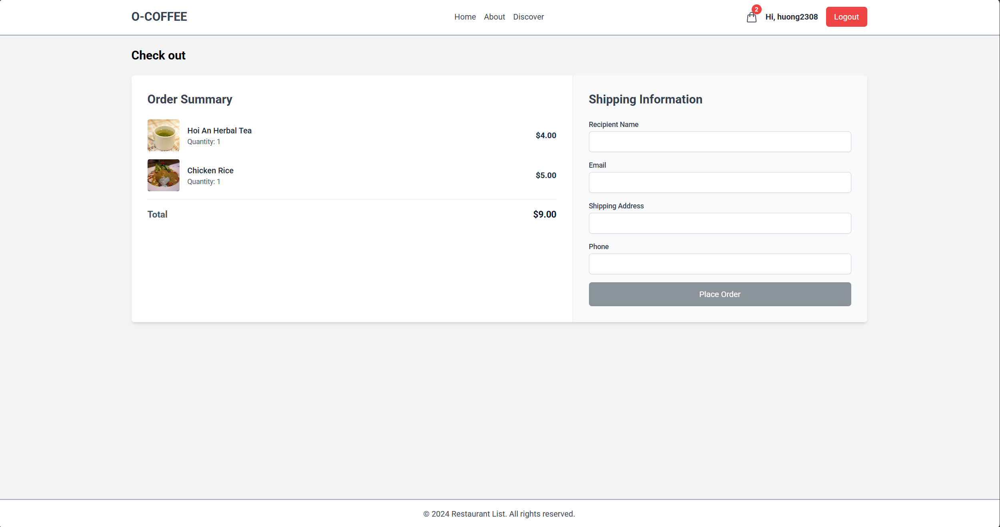
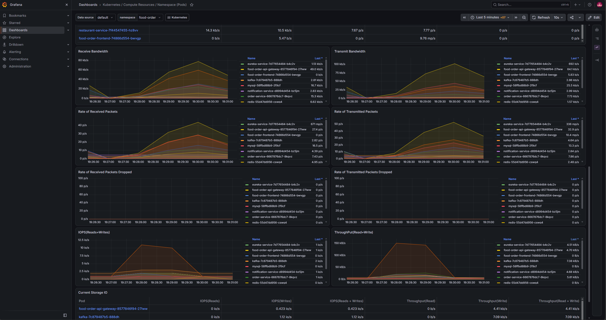
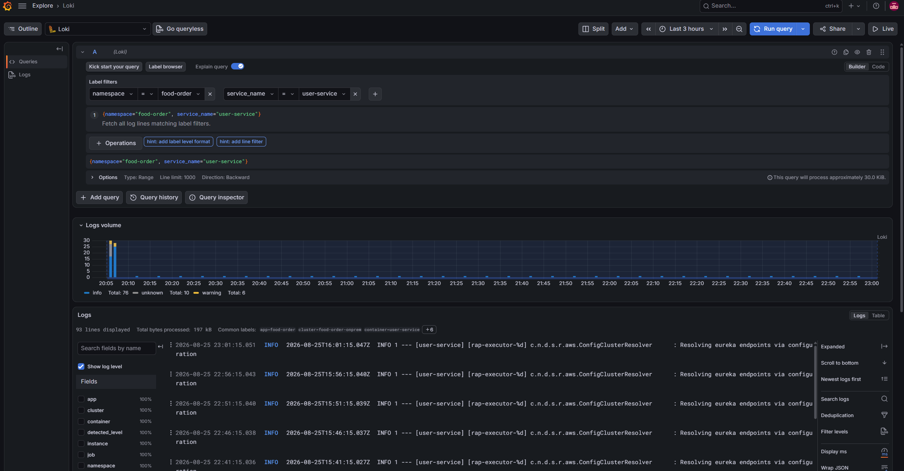

# Food Order Microservices - On-Premises DevOps Project

The application source was forked from an existing food-order microservices project. The main work in this repository is containerization, configuration, Kubernetes deployment, storage, networking, and basic operations.

Live demo: [https://food.myproject.bar](https://food.myproject.bar)

## Project Overview

This repository provides the delivery and operations platform for the existing food-order application. It runs the complete 11-component system on a three-node, on-premises Kubernetes cluster and covers container delivery, persistent storage, public routing, deployment automation, monitoring, and centralized logging.

## Architecture

```text
Internet User
     |
     v
Cloudflare Tunnel
     |
     v
Nginx Load Balancer
     |
     v
Nginx Ingress Controller - NodePort 30080
     |
     +-- /     --> Angular Frontend
     |
     +-- /api  --> API Gateway :9000
                       |
                       +-- User Service         :8081 --> MySQL user_db
                       |                                --> NFS user uploads
                       |
                       +-- Restaurant Service   :8082 --> MySQL restaurant_db
                       |                                --> NFS restaurant uploads
                       |
                       +-- Order Service        :8083 --> MySQL order_db
                       |
                       +-- Redis                :6379

User Service -----+
                  +--> Kafka :9092 --> Notification Service :8084
Order Service ----+

API Gateway and backend services <--> Eureka Service :8761
Rancher                           --> Kubernetes cluster management
Prometheus                        --> Kubernetes metrics --> Grafana dashboards
Kubernetes Pod stdout/stderr     --> Alloy DaemonSet --> Loki on NFS --> Grafana Explore
```

Only the frontend and API paths are public. Backend services and infrastructure use Kubernetes `ClusterIP` services inside the cluster.

## Implementation Highlights

- Containerized seven application components and made their runtime configuration environment-based so the same images can be promoted without rebuilding them for each environment.
- Deployed the complete 11-component application to a `kubeadm` cluster with one control plane and two worker nodes, using Kubernetes resources for configuration, workloads, networking, and persistence.
- Provisioned static NFS-backed storage for MySQL data and uploaded user and restaurant images so state remains separate from individual Pods.
- Created seven path-filtered GitHub Actions workflows that build Docker images, tag them with commit SHAs, push them to Docker Hub, and update the matching Kubernetes deployments through a self-hosted runner.
- Configured Nginx to route frontend and API traffic, then used Cloudflare Tunnel to publish `food.myproject.bar` over HTTPS without router port forwarding.
- Combined Prometheus and Grafana metrics with Loki and Grafana Alloy logs, providing a central view of cluster resources, workload status, and application errors with three-day log retention.

## Application Services

| Component | Port | Purpose |
|---|---:|---|
| Frontend | `80` | Angular web interface |
| API Gateway | `9000` | Routing, JWT validation, rate limiting, and circuit breaker |
| Eureka | `8761` | Service discovery |
| User Service | `8081` | Registration, login, profile, and JWT |
| Restaurant Service | `8082` | Restaurants, menu items, and image uploads |
| Order Service | `8083` | Order creation and order history |
| Notification Service | `8084` | Kafka events and email notifications |
| MySQL | `3306` | Three application databases |
| Redis | `6379` | API Gateway rate limiter |
| Kafka | `9092` | Asynchronous notification events |
| ZooKeeper | `2181` | Kafka coordination for this lab setup |

## On-Premises Infrastructure

| Virtual machine | Internal IP | Role |
|---|---:|---|
| `loadbalancer-server` | `192.168.1.101` | Nginx and Cloudflare Tunnel |
| `storage-server` | `192.168.1.102` | NFS server |
| `k8s-master-1` | `192.168.1.110` | Kubernetes control plane |
| `k8s-master-2` | `192.168.1.111` | Kubernetes worker |
| `k8s-master-3` | `192.168.1.112` | Kubernetes worker |
| `rancher-server` | `192.168.1.115` | Rancher server |

Current cluster setup:

- Ubuntu Server 24.04 LTS.
- Kubernetes `v1.30.14`.
- One control plane and two worker nodes.
- Pod network: `172.16.0.0/16`.
- Nginx Ingress NodePorts: `30080` and `30443`.

## Results

### Application flow

#### Coffee shop catalog


#### Checkout



#### Order confirmation


### Platform and delivery

#### GitHub Actions build and deployment


#### Rancher workloads


#### Eureka service discovery


#### Grafana Kubernetes monitoring



#### Centralized service logs



## Technology Stack

### Application

- Java 21
- Spring Boot 3.3.4
- Spring Cloud 2023.0.3
- Angular 17
- MySQL, Redis, Kafka, ZooKeeper, and Eureka

### DevOps

- Docker and Docker Compose
- Docker Hub
- Kubernetes
- Rancher
- NFS Kernel Server
- Nginx
- Cloudflare Tunnel
- VMware Workstation
- Helm
- Metrics Server
- Prometheus and Grafana
- Loki and Grafana Alloy

## Repository Structure

```text
.
|-- api-gateway/
|-- eureka-service/
|-- user-service/
|-- restaurant-service/
|-- order-service/
|-- notification-service/
|-- frontend/
|-- k8s/                 Kubernetes manifests
|-- monitoring/          Prometheus and Grafana configuration
|-- logging/             Loki, Alloy and Grafana datasource configuration
|-- nginx-lb/            Nginx load balancer configuration
|-- docs/                Project documentation
`-- screenshot/          Application and platform evidence
```

Each application service has its own Dockerfile.

## Documentation

- [On-Premises Infrastructure Setup](./docs/onprem-setup.md)
- [Kubernetes Application Deployment](./docs/kubernetes-deployment.md)
- [GitHub Actions Self-Hosted Runner Setup](./docs/self-hosted-runner-setup.md)
- [Prometheus and Grafana Monitoring Setup](./docs/monitoring-setup.md)
- [Loki and Grafana Alloy Logging Setup](./docs/logging-setup.md)

## Project Source

The original application was forked from [Vanhuyne/food-order-microservice](https://github.com/Vanhuyne/food-order-microservice).

This repository focuses on the DevOps work required to run that application with Docker and Kubernetes in an on-premises lab.
