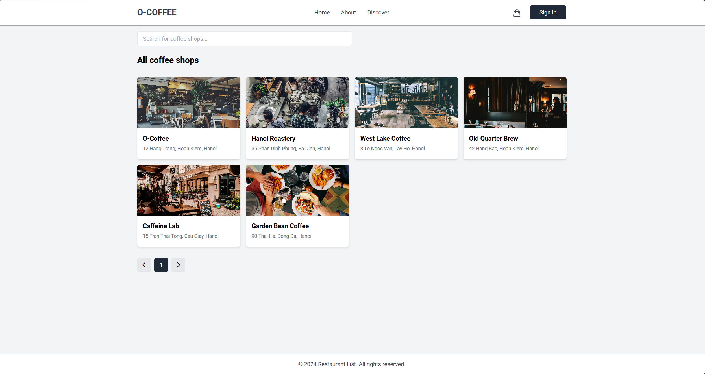
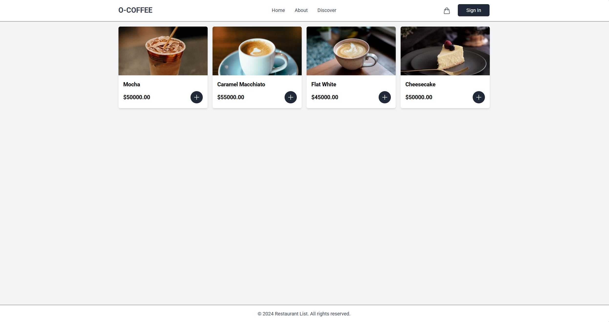
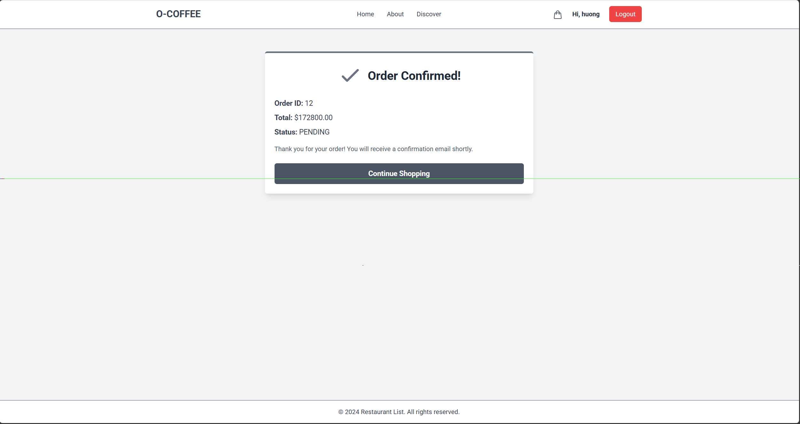
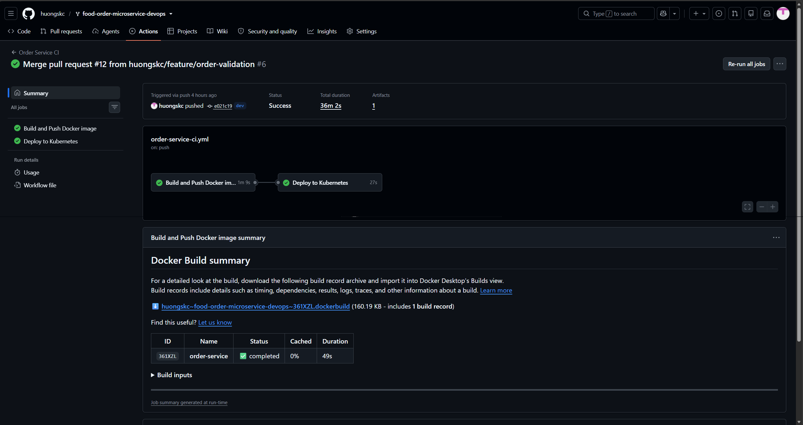
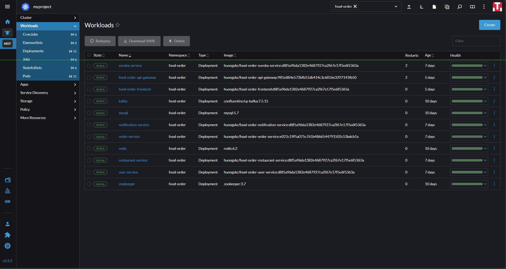
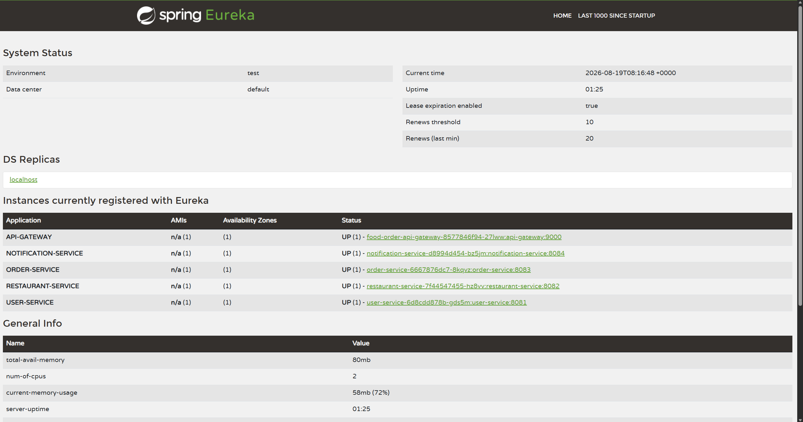

# Food Order Microservices - On-Premises DevOps Project

The application source was forked from an existing food-order microservices project. The main work in this repository is containerization, configuration, Kubernetes deployment, storage, networking, and basic operations.

Live demo: [https://food.myproject.bar](https://food.myproject.bar)

## Project Goals

- Write Dockerfiles for all services.
- Build and push images to DockerHub.
- Build a Kubernetes cluster with `kubeadm` on VMware.
- Deploy the full application with Kubernetes YAML files.
- Expose the website through Nginx and Cloudflare Tunnel.
- Use Rancher to manage and inspect the cluster.

## What Was Implemented

- Local dependencies with Docker Compose: Redis, ZooKeeper, and Kafka.
- Dockerfiles and `.dockerignore` files for the frontend and all backend services.
- DockerHub images under the `huongskc` namespace.
- A Kubernetes cluster with one control plane and two workers.
- Kubernetes ConfigMap, Secret, Deployment, Service, Ingress, PV, and PVC resources.
- Static NFS storage for MySQL and uploaded images.
- Public access through Cloudflare Tunnel.
- Rancher cluster management.
- GitHub Actions builds Docker images and deploys them to Kubernetes with a self-hosted runner.

## Demo Results

The latest on-premises deployment was checked with the following results:

- The public website is available at [food.myproject.bar](https://food.myproject.bar).
- Users can browse coffee shops, view menu items, add items to a cart, and create an order.
- Rancher shows all application workloads as active.
- Eureka shows the API Gateway and four backend services as `UP`.
- GitHub Actions builds a Docker image and deploys it to Kubernetes after a change is merged into `dev`.

### Application flow

#### Coffee shop catalog



#### Menu items



#### Order confirmation



### Platform and delivery

#### GitHub Actions build and deployment



#### Rancher workloads



#### Eureka service discovery



## Architecture

```text
Internet User
     |
     v
Cloudflare Tunnel
     |
     v
Nginx Load Balancer
     |
     v
Nginx Ingress Controller - NodePort 30080
     |
     +-- /     --> Angular Frontend
     |
     +-- /api  --> API Gateway :9000
                       |
                       +-- User Service         :8081 --> MySQL user_db
                       |                                --> NFS user uploads
                       |
                       +-- Restaurant Service   :8082 --> MySQL restaurant_db
                       |                                --> NFS restaurant uploads
                       |
                       +-- Order Service        :8083 --> MySQL order_db
                       |
                       +-- Redis                :6379

User Service -----+
                  +--> Kafka :9092 --> Notification Service :8084
Order Service ----+

API Gateway and backend services <--> Eureka Service :8761
Rancher                           --> Kubernetes cluster management
```

Only the frontend and API paths are public. Backend services and infrastructure use Kubernetes `ClusterIP` services inside the cluster.

## Application Services

| Component | Port | Purpose |
|---|---:|---|
| Frontend | `80` | Angular web interface |
| API Gateway | `9000` | Routing, JWT validation, rate limiting, and circuit breaker |
| Eureka | `8761` | Service discovery |
| User Service | `8081` | Registration, login, profile, and JWT |
| Restaurant Service | `8082` | Restaurants, menu items, and image uploads |
| Order Service | `8083` | Order creation and order history |
| Notification Service | `8084` | Kafka events and email notifications |
| MySQL | `3306` | Three application databases |
| Redis | `6379` | API Gateway rate limiter |
| Kafka | `9092` | Asynchronous notification events |
| ZooKeeper | `2181` | Kafka coordination for this lab setup |

## On-Premises Infrastructure

| Virtual machine | Internal IP | Role |
|---|---:|---|
| `loadbalancer-server` | `192.168.1.101` | Nginx and Cloudflare Tunnel |
| `storage-server` | `192.168.1.102` | NFS server |
| `k8s-master-1` | `192.168.1.110` | Kubernetes control plane |
| `k8s-master-2` | `192.168.1.111` | Kubernetes worker |
| `k8s-master-3` | `192.168.1.112` | Kubernetes worker |
| `rancher-server` | `192.168.1.115` | Rancher server |

Current cluster setup:

- Ubuntu Server 24.04 LTS.
- Kubernetes `v1.30.14`.
- One control plane and two worker nodes.
- Pod network: `172.16.0.0/16`.
- Nginx Ingress NodePorts: `30080` and `30443`.

## Technology Stack

### Application

- Java 21
- Spring Boot 3.3.4
- Spring Cloud 2023.0.3
- Angular 17
- MySQL, Redis, Kafka, ZooKeeper, and Eureka

### DevOps

- Docker and Docker Compose
- DockerHub
- Kubernetes
- Rancher
- NFS Kernel Server
- Nginx
- Cloudflare Tunnel
- VMware Workstation

## Repository Structure

```text
.
|-- api-gateway/
|-- eureka-service/
|-- user-service/
|-- restaurant-service/
|-- order-service/
|-- notification-service/
|-- frontend/
|-- k8s/                 Kubernetes manifests
|-- nginx-lb/            Nginx load balancer configuration
|-- docs/                Project documentation
|-- screenshot/          Application screenshots
`-- docker-compose.yml   Local infrastructure dependencies
```

Each application service has its own Dockerfile.

## Documentation

- [On-Premises Infrastructure Setup](./docs/onprem-setup.md)
- [GitHub Actions Self-Hosted Runner Setup](./docs/self-hosted-runner-setup.md)

## Kubernetes Deployment

### 1. Create configuration

```bash
kubectl create namespace food-order
kubectl apply -f k8s/configmap.yaml
```

Copy `k8s/secret.example.yaml` to `k8s/secret.yaml`, add local credentials, and apply it:

```bash
kubectl apply -f k8s/secret.yaml
```

### 2. Deploy storage and dependencies

Create the NFS directories on `storage-server` before applying the PersistentVolumes:

```bash
sudo mkdir -p /data/nfs-shared/food-order/mysql
sudo mkdir -p /data/nfs-shared/food-order/user-uploads
sudo mkdir -p /data/nfs-shared/food-order/restaurant-uploads
```

Deploy storage and MySQL:

```bash
kubectl apply -f k8s/storage.yaml
kubectl apply -f k8s/mysql.yaml
kubectl -n food-order rollout status deployment/mysql --timeout=5m
```

Open the MySQL client with the root password from the Kubernetes Secret:

```bash
kubectl -n food-order exec -it deployment/mysql -- mysql -u root -p
```

Create the databases and grant access to the application user. Replace `<DB_PASSWORD>` with the value of `DB_PASSWORD` in the `k8s/secret.yaml`:

```sql
CREATE DATABASE IF NOT EXISTS user_db;
CREATE DATABASE IF NOT EXISTS restaurant_db;
CREATE DATABASE IF NOT EXISTS order_db;

CREATE USER IF NOT EXISTS 'food_order_app'@'%' IDENTIFIED BY '<DB_PASSWORD>';
GRANT ALL PRIVILEGES ON user_db.* TO 'food_order_app'@'%';
GRANT ALL PRIVILEGES ON restaurant_db.* TO 'food_order_app'@'%';
GRANT ALL PRIVILEGES ON order_db.* TO 'food_order_app'@'%';
FLUSH PRIVILEGES;
```

Deploy the remaining dependencies:

```bash
kubectl apply -f k8s/redis.yaml
kubectl apply -f k8s/zookeeper.yaml
kubectl apply -f k8s/kafka.yaml
```

### 3. Deploy application services

```bash
kubectl apply -f k8s/eureka.yaml
kubectl apply -f k8s/notification.yaml
kubectl apply -f k8s/user.yaml
kubectl apply -f k8s/restaurant.yaml
kubectl apply -f k8s/order.yaml
kubectl apply -f k8s/api-gateway.yaml
kubectl apply -f k8s/frontend.yaml
```

## Verification

Check cluster resources:

```bash
kubectl get nodes -o wide
kubectl -n food-order get pods -o wide
kubectl -n food-order get services
kubectl -n food-order get endpoints
kubectl -n food-order get ingress
kubectl -n food-order get pvc
kubectl get pv
```

Check the public website and API from Windows:

```powershell
curl.exe -I https://food.myproject.bar/
curl.exe "https://food.myproject.bar/api/v1/restaurants?page=0&size=8"
```

## Project Source

The original application was forked from [Vanhuyne/food-order-microservice](https://github.com/Vanhuyne/food-order-microservice).

This repository focuses on the DevOps work required to run that application with Docker and Kubernetes in an on-premises lab.
